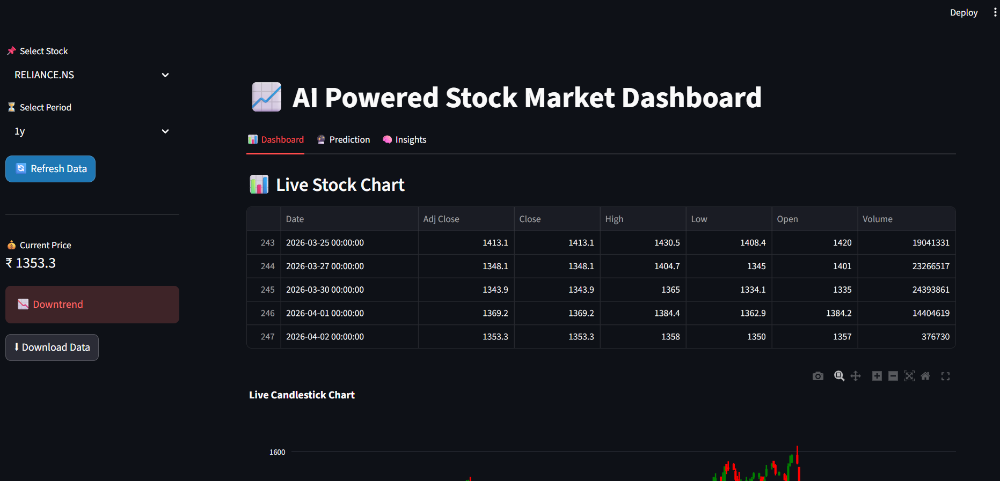
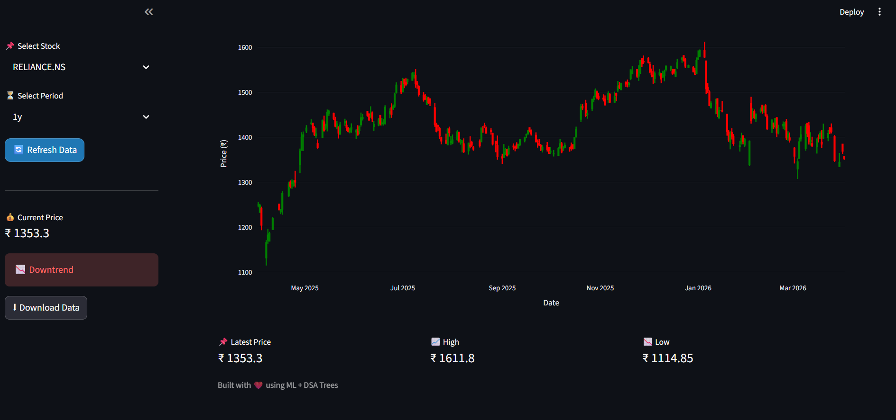
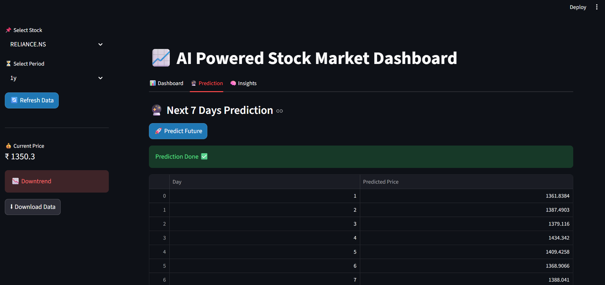
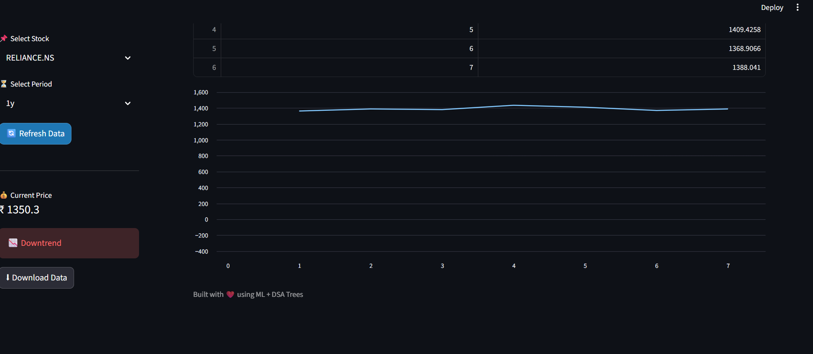
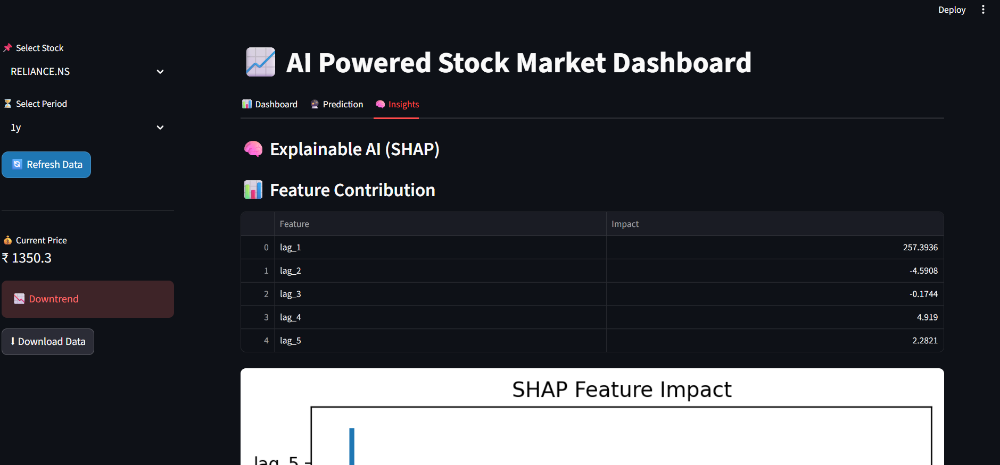
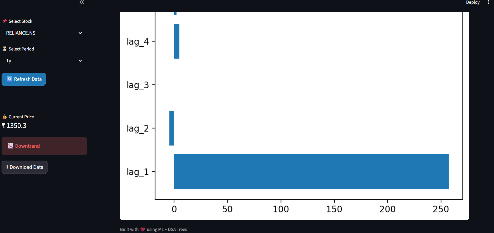

<h1 align="center"> AI Powered Stock Market Dashboard</h1>
<p align="center"> Real-Time • ML Powered • Explainable AI</p>

---

## Overview

This project is an advanced AI-powered stock market dashboard that provides real-time stock data visualization, price trend analysis, and machine learning-based predictions. It also includes explainable AI using SHAP for model transparency.

---

## Features

* Live Candlestick Chart (Plotly)
* Trend Detection (Uptrend / Downtrend)
* Machine Learning Prediction
* SHAP Explainable AI Insights
* Download Stock Data (CSV)
* Interactive Dashboard (Streamlit UI)

---

## Tech Stack

* Python
* Streamlit
* Plotly
* Pandas
* yFinance
* Scikit-learn
* SHAP

---

## Screenshots

### Dashboard


---

---
### Prediction


---

---
### Insights


---


---

## Installation

```bash
git clone https://github.com/your-username/stock-market-ai-dashboard.git
cd stock-market-ai-dashboard
pip install -r requirements.txt
streamlit run app.py
```

---

## How It Works

* Fetches real-time stock data using yFinance
* Processes and cleans data using Pandas
* Applies ML model for prediction
* Uses SHAP to explain predictions
* Visualizes results using Plotly & Streamlit

---

## Future Improvements

* Portfolio Tracking
* News Sentiment Analysis
* Real-time Alerts
* Login Authentication

---

## 👩‍💻 Author

Meenakshi Rani

---
